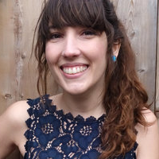
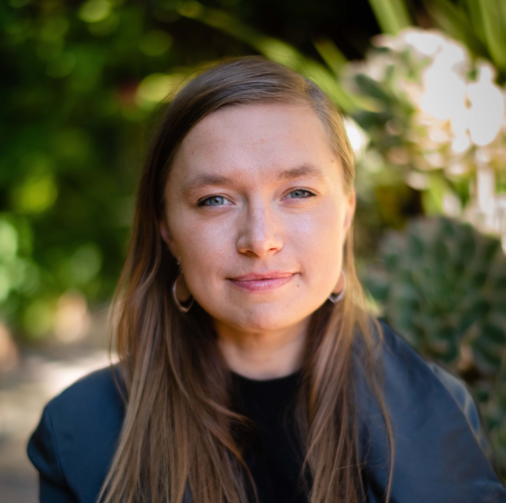

<link rel="stylesheet" href="{{ site.baseurl | prepend: site.url }}/custom.css">

    <!-- 

        <h1>Timeline</h1>
    
 -->

    

        

        

            
 

            

            

                <h1>Causal Abstractions</h1>
                 
                 
                
Date: July, coming soon.

                
Time: Coming soon
                
                

            
            

                <h2>speakers</h2>
                <a href="http://web.stanford.edu/~icard/" style="position:relative; display:block">Thomas Icard</a>
                 Stanford University
                 
                
                 
                <a href="http://www.zenna.org/"  style="position:relative; display:block">Zenna Tavares</a> Basis, Columbia University
                
                
                 
                <a href="https://elc-lab-ucsd.com/" style="position:relative; display:block">Caren Walker</a> 
                UCSD
                 
                
                

            

        

        

            
 

            

            

                <h1>Language</h1>
                 
                 
                
Date: July, coming soon.

                
Time: Coming soon
                
                

                

                <h2>speakers</h2>
                <a href="http://web.stanford.edu/~icard/" style="position:relative; display:block">Thomas Icard</a>
                 Stanford University
                 
                
                 
                <a href="http://www.zenna.org/"  style="position:relative; display:block">Zenna Tavares</a> Basis, Columbia University
                
                 
                <a href="https://elc-lab-ucsd.com/" style="position:relative; display:block">Caren Walker</a> 
                UCSD
                 
                
                

            

        

        

            
 

            

                

                <h1>Language</h1>
                 
                 
                
Date: July, coming soon.

                
Time: Coming soon
    
                

                

                <h2>speakers</h2>

                <a href="https://www.mit.edu/~jda/" style="position:relative; display:block">Jacob Andreas</a>
                MIT
                 
                
                 

                 <a href="https://abcarstensen.com/" style="position:relative; display:block">Alexandra Cartensen</a>
                 UCSD
                  
                
                  
                <a href="https://rdhawkins.com/" style="position:relative; display:block">Robert Hawkins</a>
                Princeton
                 
                

                  

                <a href="https://www.alanesuhr.com/" style="position:relative; display:block">Alane Suhr</a>
                UC Berkeley
                 
                
                

            

        

        

            
 

            

             

                <h1>Language</h1>
                 
                 
                
Date: July, coming soon.

                
Time: Coming soon
    
                

                

                <h2>speakers</h2>

                <a href="https://k-r-allen.github.io/" style="position:relative; display:block">Kelsey Allen</a>
                DeepMind
                 
                

                 

                 <a href="https://neuroscience.stanford.edu/people/daniel-bear"  style="position:relative; display:block">Daniel Bear</a>
                Stanford University
                 
                

                  

                 <a href="https://www.psych.ucla.edu/faculty-page/hongjing/"  style="position:relative; display:block">Hongjing Lu</a>
                UCLA
                 
                

                  

                <a href="https://markkho.github.io/" style="position:relative; display:block">Mark Ho</a>
                NYU
                 
                
                

            

        

        

            
 

            

             

                <h1>Memory Seminar</h1>
                 
                 
                
Date: July, coming soon.

                
Time: Coming soon
    
                

                

                <h2>speakers</h2>

                <a href="http://www.chrisbaldassano.com/" style="position:relative; display:block">Chris Baldassano</a>
                DeepMind
                 
                

                 

                 <a href="https://annaleshinskaya.com/"  style="position:relative; display:block">Anna Leshinskaya</a>
                UC Davis
                 
                

                  

                 <a href="https://sites.google.com/view/alexatompary"  style="position:relative; display:block">Alexa Tompary</a>
                Drexel
                 
                

                  

                <a href="https://www.jcrwhittington.com/" style="position:relative; display:block">James Whittington</a>
                Stanford, Oxford
                 
                
                

            

        

     

            
 

            

            <h2> CogSci 2023</h2>
            
Date: July 25th

            
Sydney, Australia

                

            

        

    

<script src="{{ site.baseurl | prepend: site.url }}/timeline.js">
