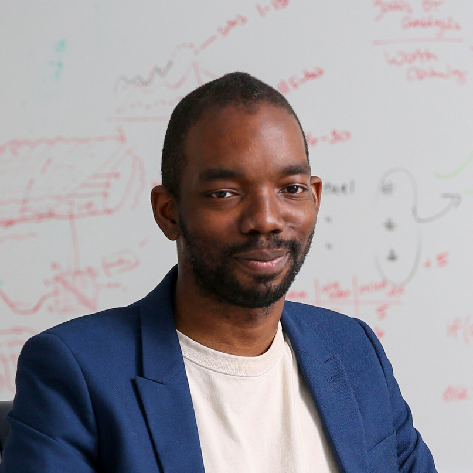

<link rel="stylesheet" href="{{ site.baseurl | prepend: site.url }}/custom.css">

    <!-- 

        <h1>Timeline</h1>
    
 -->

    

        

        

            
 

            

            

                <h1>Causal Abstractions</h1>
                 
                 
                
Date: July, coming soon.

                
Time: Coming soon
                
                

                

                <h2>speakers</h2>
                <a href="http://web.stanford.edu/~icard/" style="position:relative; display:block">Thomas Icard</a>
                 Stanford University
                 
                
                 
                <a href="http://www.zenna.org/"  style="position:relative; display:block">Zenna Tavares</a> Basis, Columbia University
                
                
                 
                <a href="https://elc-lab-ucsd.com/" style="position:relative; display:block">Caren Walker</strong> </a> UCSD
                
                

            

        

        

            
 

            

                

                <h1>Language Seminar</h1>
                 
                 
                
Date: July, coming soon.

                
Time: Coming soon
    
                

                

                <h2>speakers</h2>

                <a href="https://www.mit.edu/~jda/" style="position:relative; display:block">Jacob Andreas</strong> </a>
                MIT
                 
                

                 

                 <a href="https://abcarstensen.com/" style="position:relative; display:block">Alexandra Cartensen</a>
                 UCSD
                

                  

                <a href="https://rdhawkins.com/" style="position:relative; display:block">Robert Hawkins</a>
                Princeton
                

                  

                <a href="https://www.alanesuhr.com/" style="position:relative; display:block">Alane Suhr</a>
                UC Berkeley
                 
                
                

                  
                  

            

        

        

            
 

            

             

                <h1>neuroscience seminar</h1>
                 
                 
                
Date: Wednesday, July 13

                
Time: 12PM-1:30PM PDT

                
<a href="https://www.youtube.com/watch?v=UoBZp4hDY-U&list=PL2_Vc3j_d7HPHojt9q2pP8A3AM_pIGy7C&index=3" style="position:relative; display:block">Link to recordings</a>

                

                

                <h2>speakers</h2>

                <a href="https://brainbridgelab.uchicago.edu/people/" style="position:relative; display:block">Wilma Bainbridge<strong> (Chair)</strong></a>
                University of Chicago
                

                 

                 <a href="https://www.thelamplab.ca/lab-members"  style="position:relative; display:block">Jeffrey Wammes<strong> (Speaker)</strong></a>
                Queen's University
                

                  

                <a href="http://www.mrc-cbu.cam.ac.uk/people/Matt.Lambon-Ralph/" style="position:relative; display:block">Matt Lambon-Ralph<strong> (Speaker)</strong></a>
                University of Cambridge
                

                

            

        

     

            
 

            

            <h2> CogSci 2022</h2>
            
Date: July 27th, 08:30 – 16:30 EDT

            
Toronto, Canada

                

            

        

    

<script src="{{ site.baseurl | prepend: site.url }}/timeline.js">
